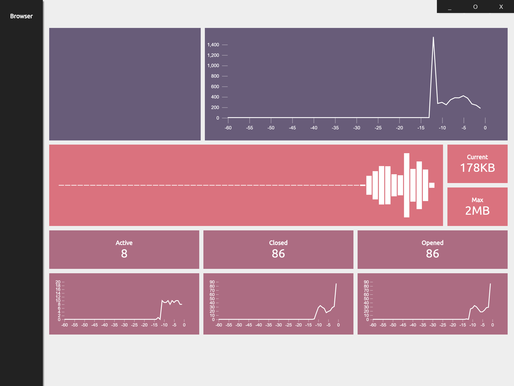

# Load Have Mercy - Beta
## Description 
__Load Have Mercy__ is load test / crawler with the the intention of identifying slow areas on a site. It start with the page you have currently loaded in it's browser and goes from there. It doesn't make requests for images/js/css or any other url not in an anchor tag. The idea is to make request to pages that will put extra stress on a server not the CDN. There are many things on the roadmap, currently it only has a few option.

## Installation
`npm install`

## Run
`npm start`

## Config Options
* **Max URLs To Crawl**  
How many urls to crawl before stopping.
* **Max Requests Per Second**  
How many requests to make per second.
* **Max Requests Open**  
How many concurrent requests to have open.
* **Follow External Domains**  
Should the crawler follow links outside of the domain. 
* **Follow Subdomains**  
Should the crawler follow sublink domains. 
* **Case Sensitive**  
URL uniqueness require case sensitivity. 

# Screenshots
### Browser

### Config

### Running

### Results

### Infograph
